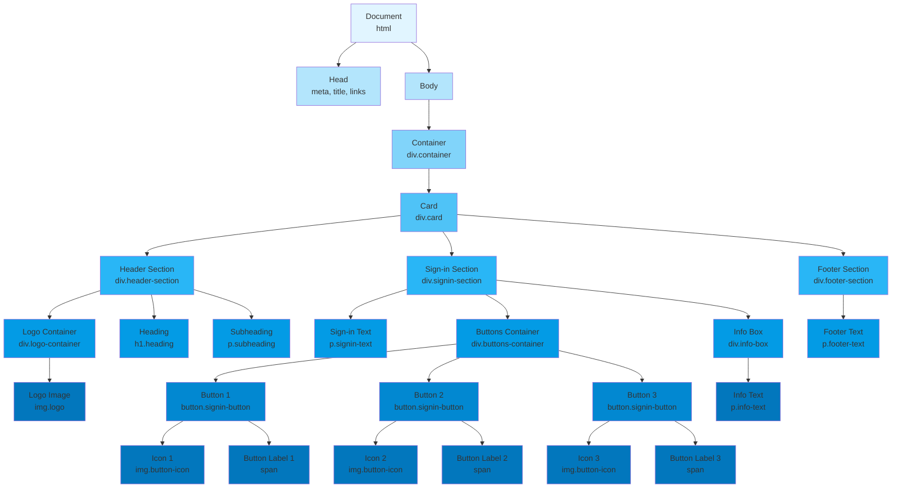

# AgentFlow Component Hierarchy

## Component Structure Overview

### Root Level
- **Document** (`<html>`)
  - Head metadata and styling links
  - Body content

### Main Container
- **Container** (`.container`)
  - Wrapper with max-width 480px
  - Flexbox centering

### Card Component
- **Card** (`.card`)
  - White background, bordered, rounded corners
  - Contains 3 main sections

### Section 1: Header Section (`.header-section`)
- **Logo Container** (`.logo-container`)
  - AgentFlow logo image (64x64px)
- **Heading** (`<h1>`)
  - "AgentFlow" title text
- **Subheading** (`
`)
  - "AI-Powered Project Management Suite" tagline

### Section 2: Sign-in Section (`.signin-section`)
- **Sign-in Text** (`
`)
  - "Sign in with your workspace account"
- **Buttons Container** (`.buttons-container`)
  - Button 1: Continue with Jira
    - Jira icon (16x16px)
    - Button label text
  - Button 2: Continue with GitHub
    - GitHub icon (16x16px)
    - Button label text
  - Button 3: Continue with Azure DevOps
    - Azure icon (16x16px)
    - Button label text
- **Info Box** (`.info-box`)
  - Disclaimer text about credential usage

### Section 3: Footer Section (`.footer-section`)
- **Footer Text** (`
`)
  - "By signing in, you agree to our Terms of Service"

## DOM Depth

- **Level 0**: html
- **Level 1**: head, body
- **Level 2**: container
- **Level 3**: card
- **Level 4**: header-section, signin-section, footer-section
- **Level 5**: logo-container, h1, p (subheading), signin-text, buttons-container, info-box, footer-text
- **Level 6**: img (logo), button × 3, p (info-text)
- **Level 7**: img (icons × 3), span (labels × 3)

## Total Components: 23

| Component Type | Count |
|---|---|
| Containers/Sections | 8 |
| Text Elements | 7 |
| Buttons | 3 |
| Images | 5 |
| Total | 23 |
